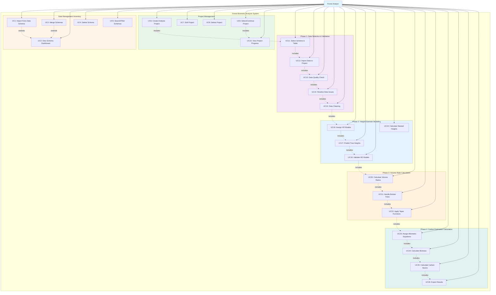

# Forest Biometric Analysis System - Use Case Diagram

## Use Case Diagram (Mermaid)

## Use Case Descriptions

### Data Management (Inventory)

- **UC1: Import Foris Data Schema** - Upload SQL zip files containing forest inventory data from Foris database schemas
- **UC2: Merge Schemas** - Combine multiple database schemas into a single merged schema
- **UC3: View Schema Dashboard** - View all imported and merged schemas with their details
- **UC4: Delete Schema** - Remove a schema and all its associated data
- **UC5: Search/Filter Schemas** - Search and filter schemas by name, type, or other criteria

### Project Management

- **UC6: Create Analysis Project** - Create a new forest biometric analysis project with name and description
- **UC7: Edit Project** - Modify project name and details
- **UC8: Delete Project** - Permanently delete a project and all its analysis data
- **UC9: Select/Continue Project** - Select an existing project to continue work
- **UC10: View Project Progress** - View the current phase and step progress of a project

### Phase 1: Data Selection & Validation

- **UC11: Select Schema & Table** - Choose the data source (schema and table) for analysis
- **UC12: Import Data to Project** - Import selected data into the analysis project with options for handling existing data
- **UC13: Data Quality Check** - Validate data quality including Plot Codes, Physiography Zones, Tree Numbers, Species Codes, and DBH
- **UC14: Resolve Data Issues** - Correct or ignore identified data quality issues
- **UC15: Data Cleaning** - Remove ignored records to prepare data for analysis

### Phase 2: Height-Diameter Modeling

- **UC16: Assign HD Models** - Assign species-specific height-diameter models based on species and physiography zones
- **UC17: Predict Tree Heights** - Predict tree heights for trees with missing or invalid height measurements
- **UC18: Validate HD Models** - Validate the accuracy of height-diameter models
- **UC19: Calculate Slanted Heights** - Calculate corrected heights for slanted tree measurements

### Phase 3: Volume Ratio Calculation

- **UC20: Calculate Volume Ratios** - Calculate volume ratios for broken trees using taper functions
- **UC21: Handle Broken Trees** - Process trees with broken tops to correct biomass estimates
- **UC22: Apply Taper Functions** - Apply Fibonacci taper functions to determine remaining volume in damaged trees

### Phase 4: Carbon Estimation Calculation

- **UC23: Assign Allometric Equations** - Assign allometric equations to species for biomass calculation
- **UC24: Calculate Biomass** - Calculate tree biomass components (stem, branch, and foliage)
- **UC25: Calculate Carbon Stocks** - Estimate carbon stocks and CO2 equivalent from biomass
- **UC26: Export Results** - Export analysis results and calculated data to CSV format

## Relationships

- **Includes**: A use case that must be completed as part of another use case
- **Extends**: A use case that optionally extends another use case
- **Workflow**: The sequential flow from Phase 1 through Phase 4 represents the main analysis workflow
